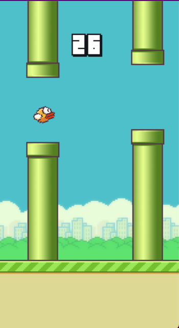
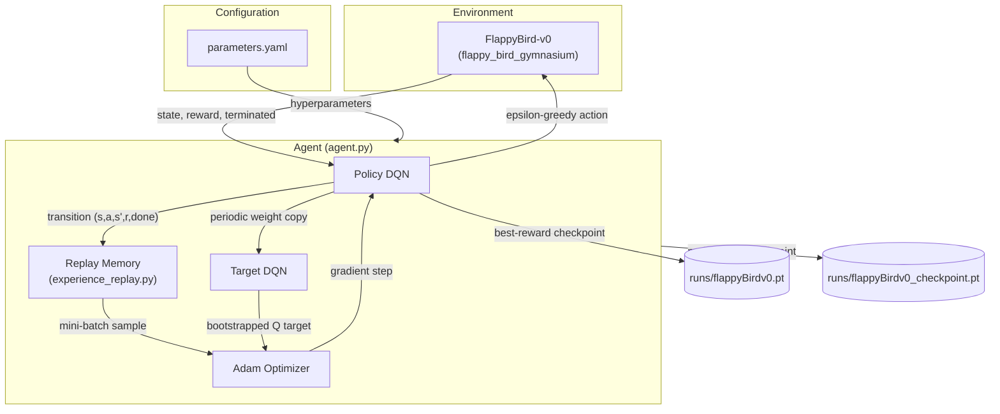
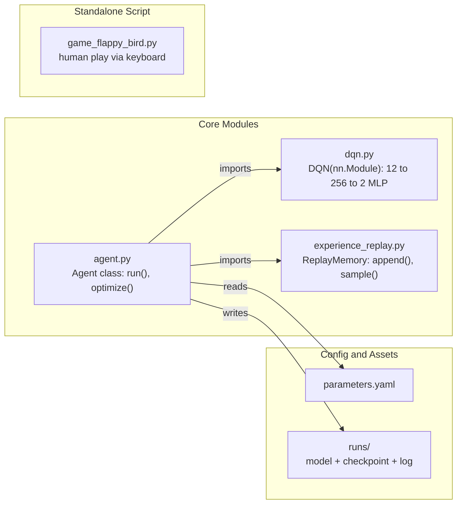
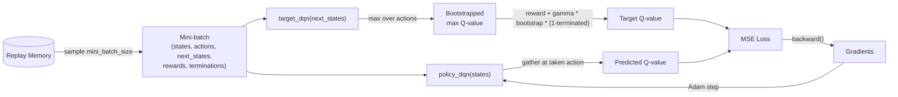
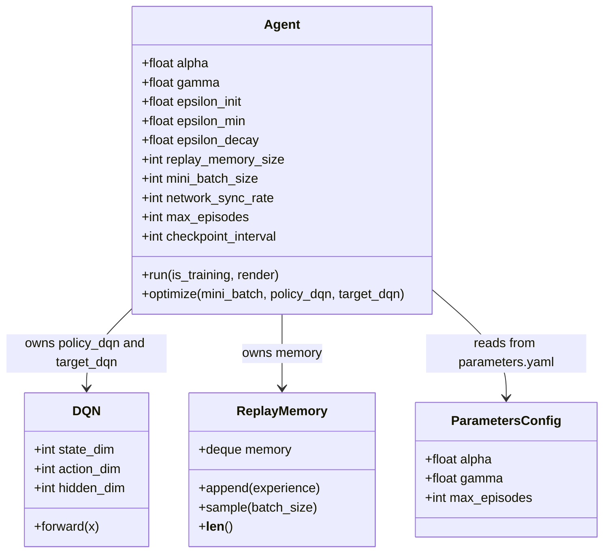
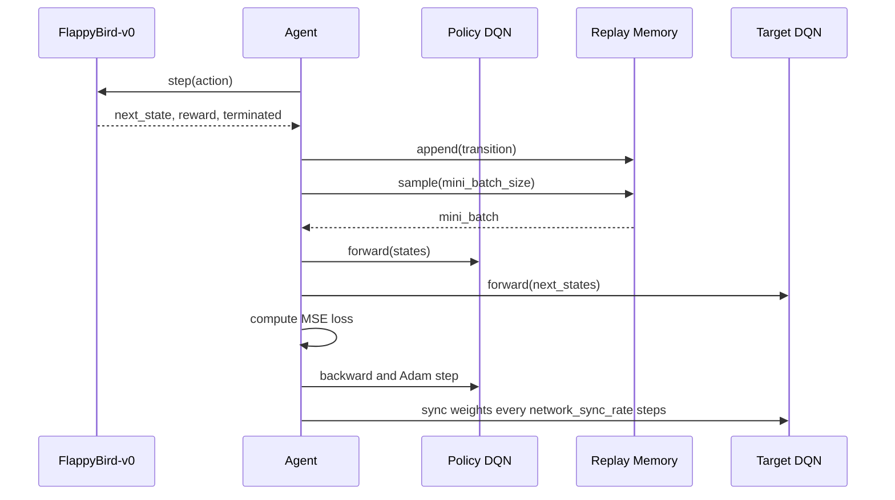
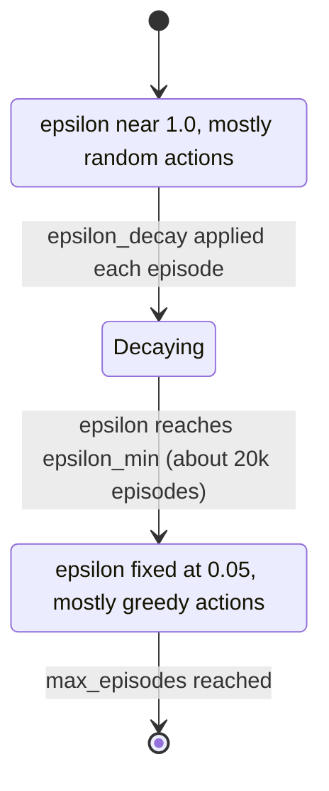
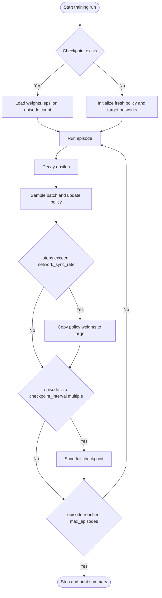
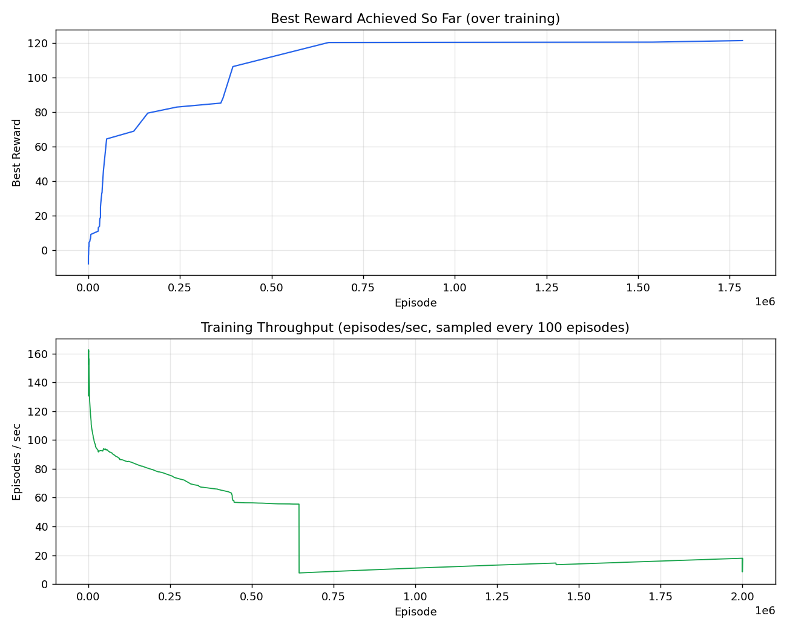

# FlapMind

**A from-scratch Deep Q-Network agent that learns to play Flappy Bird through trial and error.**


---

## Demo



*The trained agent (loaded from `runs/flappyBirdv0.pt`) playing live via `python agent.py flappyBirdv0`.*

---

## Problem Statement

Flappy Bird is a simple game with a hard credit-assignment problem: a single bad flap several steps before a pipe collision is what actually kills the bird, not the collision itself. There's no labeled dataset of "correct" actions — the only signal is a sparse, delayed reward. This makes it a clean, low-dimensional testbed for learning how reinforcement learning actually works, without the complexity of pixel-based Atari environments.

## Solution Overview

FlapMind implements a **Deep Q-Network (DQN)** agent from the ground up — no RL library abstractions (no Stable-Baselines3, no RLlib) — so every piece of the algorithm is visible and hackable: the replay buffer, the target network, the epsilon-greedy exploration schedule, and the Bellman-equation loss are all hand-written in plain PyTorch. The agent observes a 12-dimensional state vector from [`flappy_bird_gymnasium`](https://github.com/markub3327/flappy-bird-gymnasium) (bird position/velocity, next pipe position and gap) and chooses one of two actions each frame: flap, or do nothing.

## Key Features

| Feature | Description |
|---|---|
| DQN with target network | Separate policy and target networks, synced every `network_sync_rate` steps, to stabilize the Bellman target |
| Experience replay | FIFO replay buffer (`deque`, capped at `replay_memory_size`) breaks temporal correlation between consecutive frames |
| Epsilon-greedy exploration | Decays from `1.0` to `0.05` over ~20,000 episodes (`epsilon_decay: 0.99985`) |
| Checkpointing + resume | Saves policy/target weights, optimizer state, epsilon, and episode count every `checkpoint_interval` episodes, and on `Ctrl+C` — training survives interruption, reboot, or hibernate |
| Live throughput logging | Every episode prints `episodes/sec` and elapsed time; every 100 episodes it estimates hours-remaining based on measured throughput |
| YAML-driven hyperparameters | All training knobs live in `parameters.yaml`, keyed by a named parameter set (`flappyBirdv0`) — no code edits needed to tune a run |
| Manual play mode | `game_flappy_bird.py` lets a human play the same environment with the space bar, for sanity-checking the env itself |

---

## Architecture



## Module Breakdown



---

## Technology Stack

| Technology | Category | Purpose in Project | Why Chosen |
|---|---|---|---|
| Python 3.13 | Language | Everything | Ecosystem standard for RL/ML |
| PyTorch | ML framework | DQN model definition, autograd, Adam optimizer, tensor ops | De facto standard for research-style RL code; direct control over the training loop instead of a high-level RL library |
| `flappy_bird_gymnasium` | Environment | Provides `FlappyBird-v0`, a Gymnasium-compatible Flappy Bird environment with a 12-dim state vector | Ready-made, physically consistent environment — avoids reimplementing game physics |
| Gymnasium | RL API | Standard `env.reset()` / `env.step()` interface | Industry-standard RL environment API (successor to OpenAI Gym) |
| pygame | Rendering | Renders the game window in `render_mode="human"` and handles keyboard input in `game_flappy_bird.py` | Dependency of `flappy_bird_gymnasium`'s rendering backend |
| PyYAML | Configuration | Parses `parameters.yaml` into hyperparameter dicts per named parameter set | Human-editable config without touching code |
| NumPy | Numerics | Underlying array operations (via PyTorch/Gymnasium) | Standard numerical backend |
| Matplotlib | Visualization | Available for plotting training curves from the log | Standard plotting library |
| `uv` | Package manager | Installs and manages the project's virtual environment | Fast, reproducible dependency installs |

---

## Training Episode Lifecycle

Trace of a single training episode inside `Agent.run(is_training=True)`:

```
1. EPISODE START
   └── env.reset() → initial 12-dim state tensor

2. ACTION SELECTION (per step, epsilon-greedy)
   └── if random() < epsilon: sample random action (explore)
   └── else: policy_dqn(state).argmax() under torch.no_grad() (exploit)

3. ENVIRONMENT STEP
   └── env.step(action) → next_state, reward, terminated, info
   └── episode_reward accumulates

4. EXPERIENCE STORAGE
   └── memory.append((state, action, next_state, reward, terminated))
   └── steps counter increments

5. EPISODE END (terminated, or episode_reward >= reward_threshold)
   └── print episode stats: reward, epsilon, episodes/sec, elapsed time
   └── every 100 episodes: log estimated hours-remaining to runs/flappyBirdv0.log

6. EXPLORATION DECAY
   └── epsilon = max(epsilon * epsilon_decay, epsilon_min)

7. BEST-MODEL CHECKPOINT (conditional)
   └── if episode_reward > best_reward: torch.save(policy_dqn state) to runs/flappyBirdv0.pt

8. LEARNING STEP (conditional on buffer size)
   └── mini_batch = memory.sample(mini_batch_size)
   └── optimize(mini_batch, policy_dqn, target_dqn)   [Bellman loss, backprop, Adam step]
   └── if steps > network_sync_rate: target_dqn.load_state_dict(policy_dqn.state_dict())

9. PERIODIC FULL CHECKPOINT
   └── every checkpoint_interval episodes: save policy/target weights, optimizer state,
       epsilon, best_reward, episode number to runs/flappyBirdv0_checkpoint.pt

10. TERMINATION CHECK
    └── if (episode + 1) >= max_episodes: stop
```

### Resume Lifecycle (interruption or restart)

```
python agent.py flappyBirdv0 --train
  └── Agent.__init__ reads parameters.yaml
  └── Agent.run(is_training=True) checks: does runs/flappyBirdv0_checkpoint.pt exist?
      ├── YES → load policy/target weights, optimizer state, epsilon, best_reward,
      │         resume itertools.count(start=checkpoint_episode + 1)
      └── NO  → start fresh from episode 0, epsilon_init

  On Ctrl+C during training:
  └── KeyboardInterrupt is caught → checkpoint saved immediately → re-raised → process exits cleanly
```

---

## Learning (Optimization) Data Flow



The core update, implemented in `Agent.optimize()`:

```
target_q = reward + (1 - terminated) * gamma * target_dqn(next_states).max(dim=1)[0]
current_q = policy_dqn(states).gather(dim=1, index=actions)
loss = MSE(current_q, target_q)
```

---

<details>
<summary><b>Diagrams — Class, Sequence, State, and Activity views</b></summary>

### Class Diagram



### Sequence Diagram — One Training Step



### State Diagram — Exploration Schedule



### Activity Diagram — Full Training Run



</details>

---

## Folder Structure

```
flap_mind/
├── agent.py                 # Agent class: training/eval loop, checkpointing, resume, optimize()
├── dqn.py                   # DQN(nn.Module): 12 -> 256 -> 2 MLP
├── experience_replay.py     # ReplayMemory: FIFO deque-backed replay buffer
├── game_flappy_bird.py      # Standalone script — human play via space bar (env sanity check)
├── parameters.yaml          # Named hyperparameter sets (e.g. flappyBirdv0)
├── requirements.txt         # numpy, matplotlib (core ML deps installed separately, see below)
├── docs/
│   └── images/
│       ├── agent_playing_demo.png   # Screenshot of the trained agent playing
│       └── training_curve.png       # Best-reward + throughput plot, generated from runs/flappyBirdv0.log
├── runs/                    # Created at runtime
│   ├── flappyBirdv0.pt              # Best-reward model weights (tracked in git — small, ~18KB)
│   ├── flappyBirdv0_checkpoint.pt   # Full training checkpoint (gitignored — transient)
│   └── flappyBirdv0.log             # Best-reward + timing log (gitignored — grows large)
└── .gitignore                # Excludes __pycache__/, .venv/, runs/*.log, runs/*_checkpoint.pt
```

---

## Prerequisites

- Python 3.10+ (developed and tested on 3.13)
- [`uv`](https://github.com/astral-sh/uv) for environment and package management (any `pip`-compatible tool works too)
- No GPU required — trains on CPU (see [Results](#results-and-known-limitations) for realistic throughput expectations)

## Installation

```bash
git clone https://github.com/KARTHIKAKRISHNA123/flap-mind.git
cd flap-mind
uv venv
# Windows:
.venv\Scripts\activate
# macOS/Linux:
source .venv/bin/activate

uv pip install pyyaml torch numpy flappy_bird_gymnasium gymnasium pygame matplotlib
```

## Usage

**Train** (auto-resumes from `runs/flappyBirdv0_checkpoint.pt` if one exists):

```bash
python agent.py flappyBirdv0 --train
```

Press `Ctrl+C` at any time — a checkpoint is saved immediately before exit, and re-running the same command resumes exactly where it left off.

**Watch the trained agent play** (loads the best-reward model, renders with pygame):

```bash
python agent.py flappyBirdv0
```

> ℹ️ This mode currently loops indefinitely (`itertools.count()` with no episode cap in eval mode) — close the pygame window or `Ctrl+C` in the terminal to stop it.

**Play manually** (sanity-check the environment yourself):

```bash
python game_flappy_bird.py
```

---

## Configuration (`parameters.yaml`)

All hyperparameters live under a named key (`flappyBirdv0`) so multiple configurations can coexist:

| Parameter | Value | Meaning |
|---|---|---|
| `env_id` | `FlappyBird-v0` | Gymnasium environment ID |
| `alpha` | `0.001` | Adam learning rate |
| `gamma` | `0.99` | Discount factor for future rewards |
| `epsilon_init` | `1` | Initial exploration rate (100% random) |
| `epsilon_min` | `0.05` | Exploration floor |
| `epsilon_decay` | `0.99985` | Per-episode multiplicative decay — reaches `epsilon_min` around episode 20,000 |
| `replay_memory_size` | `10000` | Max transitions kept in the replay buffer |
| `mini_batch_size` | `32` | Transitions sampled per gradient step |
| `network_sync_rate` | `10` | Training steps between target-network syncs |
| `reward_threshold` | `1000` | Caps a single episode's length once this cumulative reward is hit |
| `max_episodes` | `2000000` | Training stops automatically at this episode count |
| `checkpoint_interval` | `500` | Episodes between full checkpoint saves |

---

## Results and Known Limitations

A full 2,000,000-episode training run was completed on CPU (no CUDA/GPU), achieving roughly **15–90 episodes/sec** depending on episode length at the time (throughput naturally drops as the agent survives longer per episode). The run was interrupted mid-training by a laptop hibernate/resume cycle and the exact same command resumed it correctly from the last checkpoint with no lost progress.



*Generated directly from `runs/flappyBirdv0.log` — top: best reward achieved so far at each point in training; bottom: measured episodes/sec throughput.*

- **Best single-episode reward reached: 121.5**, first hit around **episode ~700,000**.
- The top plot shows the best-reward curve going completely flat after that point — across the remaining **~1.3 million episodes**, the agent never beat its own best score. Training continued, but genuine improvement had already stopped well before the run ended.
- By the end of the run, most individual episodes clustered in a much lower reward range (roughly 3.9–13, with many episodes producing near-identical reward values), consistent with the policy having converged to a small set of short, repeated behaviors rather than the strategy that earned the 121.5 best.
- Likely contributing factors: a fairly small replay buffer (`replay_memory_size: 10000`) relative to 2M episodes of experience, and a very frequent target-network sync (`network_sync_rate: 10`), both of which can destabilize or bias learning over very long runs.
- This is a known characteristic of vanilla DQN — it is prone to overestimation bias and instability without further refinements, which motivates the roadmap below. The clear, measurable plateau here is itself a useful result: it shows *when* to stop a run like this in the future (well under 1M episodes for this configuration) rather than assuming more episodes always means a better agent.

## Roadmap

- [ ] **Double DQN** — decouple action selection from action evaluation to reduce Q-value overestimation
- [ ] **Larger replay buffer** and less frequent target sync, to see whether the plateau is a stability artifact
- [ ] **Proper evaluation script** — run N episodes with epsilon=0 and report mean/median/max reward, separate from the training loop
- [ ] **Episode cap for play mode** — stop the render loop automatically instead of requiring a manual close
- [ ] **PPO comparison** — train a policy-gradient baseline on the same environment and compare sample efficiency and final performance against DQN
- [ ] **Training curve plotting** — parse `runs/flappyBirdv0.log` and plot reward/epsilon/throughput over time

---

## Troubleshooting

| Symptom | Cause | Fix |
|---|---|---|
| `ModuleNotFoundError: No module named 'yaml'` | PyPI package is `pyyaml`, not `yaml` | `uv pip install pyyaml` |
| `ModuleNotFoundError` after activating a venv | Activated a different/fresh venv than the one packages were installed into | Confirm which `.venv` is active; reinstall deps in that one |
| `TypeError: ... unexpected keyword argument 'use_Lidar'` | `flappy_bird_gymnasium`'s actual kwarg is lowercase `use_lidar` | Use `use_lidar=False` in `gym.make(...)` |
| Training seems to hang or a stale `.git/index.lock` blocks commits | An interrupted git operation left a lock file | `rm -f .git/index.lock` (only if no other git process is actually running) |

---

## Author

**Karthika Krishna M (KK)** — final-year Computer Science and Engineering student, building FlapMind as part of an ongoing AI/ML learning path (part of the [`AIML_Knowledge_Base`](https://github.com/KARTHIKAKRISHNA123/AIML_Knowledge_Base) portfolio repo).

## License

MIT